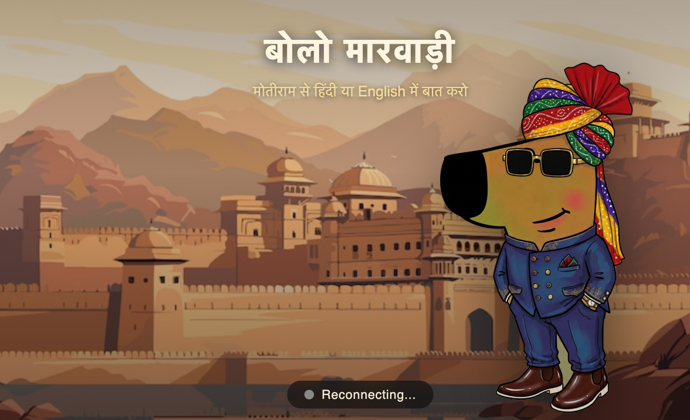

# boloMarwadi



this is just a simple fun/creative project which i thought would be cool to build, as i'm not able to find any native speakers of my language at the place i currently live in. this was mostly vibe coded with the help of claude code on a weekend while i was having my breakfast, so please don't get pissed off if this doesnt work in the way indented on your local system (it works perfectly fine on my m4 :)). 

this is the directory structure:
```
├── src
│   ├── main.py
│   ├── llm.py
│   ├── stt.py
│   ├── tts.py
│   └── track_metrics.py
├── frontend
│   ├── index.html
│   └── assets
│       ├── chillGuy_nobg.png
│       └── rajBg.png
├── models
│   ├── llm
│   │   └── Qwen2.5-7B-Instruct-4bit
│   ├── stt
│   │   └── Voxtral-Mini-4B-Realtime-2602-4bit
│   └── tts
│       └── raj
│           ├── fastpitch
│           └── hifigan
├── prompts
│   └── marwadi_system.md
├── config.yml
├── requirements.txt
├── LICENSE
└── README.md
```